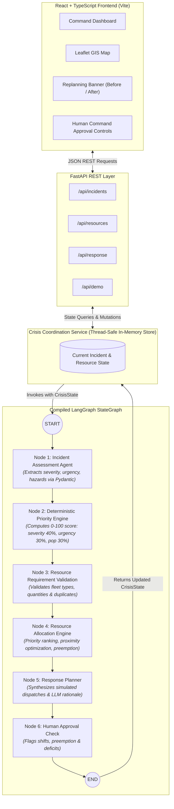
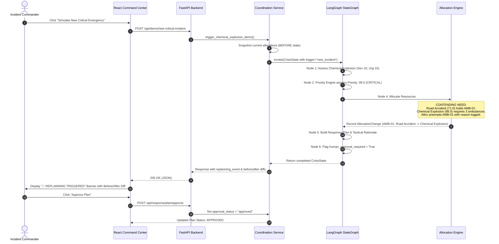

# Crisis Command — System Architecture

> **"The Multi-Agent Emergency Response & Resource Coordination Agent"**  
> *AI-Assisted Emergency Response Coordination & Decision Support System*

---

## 1. Architectural Philosophy & Safety Boundary

Crisis Command is built on a foundational safety principle: **Emergency resource dispatch must never rely on unrestrained, non-deterministic language model output.** 

The system strictly divides cognitive tasks between Large Language Models and deterministic Python engines:

| Capability | Component | Implementation | Determinism |
| :--- | :--- | :--- | :--- |
| **Incident Understanding** | Incident Assessment Agent | LLM / Domain Classifier | Guided AI |
| **Hazard Analysis** | Incident Assessment Agent | Pydantic Schema Enforcement | Structured AI |
| **Priority Scoring (0-100)** | Priority Engine | Deterministic Python Formula | 100% Deterministic |
| **Resource Validation** | Validation Node | Set Membership & Range Logic | 100% Deterministic |
| **Resource Allocation** | Allocation Engine | Priority Preemption & Proximity (Haversine) | 100% Deterministic |
| **Dynamic Replanning** | Replanning Engine | State Diffing & Conflict Resolution | 100% Deterministic |
| **Tactical Explanations ("Why?")** | Response Planner | LLM Narrative Synthesis | Guided AI |
| **Human Command Approval** | Approval Check Node | Threshold & Preemption Policy | 100% Deterministic |

---

## 2. End-to-End System Workflow

The diagram below illustrates the end-to-end multi-agent pipeline orchestrated through LangGraph:



---

## 3. Dynamic Replanning Architecture

Dynamic replanning is triggered automatically whenever field conditions shift:
1. **New High-Severity Incident Arrives** (e.g. Chemical Explosion, Priority 99)
2. **Resource Failure While Assigned** (e.g. AMB-01 mechanical breakdown)
3. **Emergency Severity Escalates**
4. **Active Emergency Resolved** (freed resources returned to reserve)



---

## 4. CrisisState Specification

The shared LangGraph state `CrisisState` is strongly typed and serialized across the workflow nodes:

```python
class CrisisState(TypedDict, total=False):
    # Core entities
    incidents: Dict[str, Dict[str, Any]]
    resources: Dict[str, Dict[str, Any]]

    # Context & Triggers
    current_incident_id: Optional[str]
    trigger_type: str  # "new_incident", "replan", "resource_failure", "incident_resolved"

    # Multi-Agent Outputs
    assessments: Dict[str, Dict[str, Any]]
    priorities: Dict[str, Dict[str, Any]]
    resource_requirements: Dict[str, Dict[str, int]]
    allocations: Dict[str, List[str]]          # Current: incident_id -> [resource_ids]
    previous_allocations: Dict[str, List[str]] # Snapshot: Before state

    # Response & Auditing
    response_plan: Optional[Dict[str, Any]]
    changes: List[Dict[str, Any]]              # Audit log of every reallocation
    alerts: List[str]
    conflicts: List[str]
    human_approval_required: bool
    approval_reasons: List[str]
    approval_status: str

    # Replanning Metas
    replanning_triggered: bool
    replanning_reason: Optional[str]
    timeline: List[Dict[str, Any]]             # High-resolution audit trajectory
    timestamps: Dict[str, str]
```

---

## 5. Transparent Deterministic Priority Formula

The priority engine normalizes factors and guarantees reproducible scoring without LLM hallucinations:

$$\text{Base Score} = (S_{\text{norm}} \times w_s) + (U_{\text{norm}} \times w_u) + (P_{\text{norm}} \times w_p)$$

Where:
- $S_{\text{norm}} = (\text{Severity} / 10) \times 100$
- $U_{\text{norm}} = (\text{Urgency} / 10) \times 100$
- $P_{\text{norm}} = \min(100.0, 15.0 + \frac{\log_{10}(\text{People} + 1)}{\log_{10}(51)} \times 85.0)$
- Configurable weights: $w_s = 0.40, w_u = 0.30, w_p = 0.30$
- Life-safety Hazard Type Bonus:
  - Chemical Explosion: $+5.0$
  - Building Collapse: $+4.0$
  - Fire / Earthquake: $+3.0$
- Direct Casualty Increment: $\min(8.0, \text{Casualties} \times 1.5)$

**Priority Levels:**
- **CRITICAL**: $\text{Score} \ge 85.0$
- **HIGH**: $\text{Score} \ge 70.0$
- **MEDIUM**: $\text{Score} \ge 45.0$
- **LOW**: $\text{Score} < 45.0$

---

## 6. Proximity-Ranked Allocation & Preemption Logic

1. **Available Reserves First**: Search unassigned available resources of the requested type. If multiple exist, rank by Haversine distance from incident coordinates:
   $$d = 2R \arcsin\left(\sqrt{\sin^2\left(\frac{\Delta \text{lat}}{2}\right) + \cos(\text{lat}_1)\cos(\text{lat}_2)\sin^2\left(\frac{\Delta \text{lon}}{2}\right)}\right)$$
2. **Priority Preemption**: If no free resources exist, check assigned resources from incidents with strictly lower priority ($\Delta \ge 5.0$ points). Preempt the resource from the lowest-priority incident.
3. **Change Logging**: Automatically record an `AllocationChange` with previous incident, new incident, and mathematical justification.
4. **Approval Escalation**: Any preemption from an active incident automatically flags `human_approval_required = True`.
